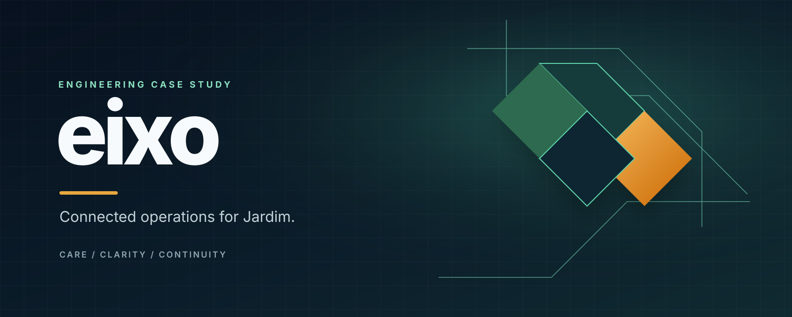
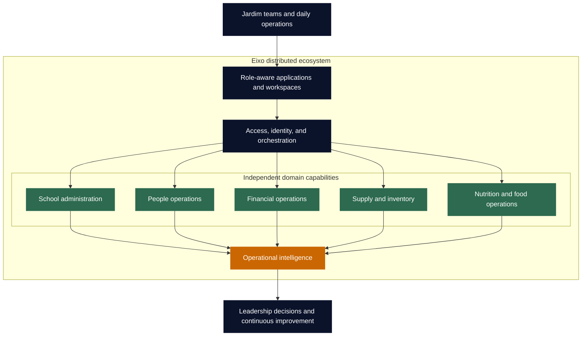

<p align="center">
  
</p>

<p align="center">
  <strong>One operational ecosystem. Clearer work. Stronger decisions.</strong>
</p>

<p align="center">
  <a href="#purpose">Purpose</a> &nbsp;|&nbsp;
  <a href="#ecosystem-architecture">Architecture</a> &nbsp;|&nbsp;
  <a href="#operational-domains">Domains</a> &nbsp;|&nbsp;
  <a href="#engineering-principles">Engineering</a> &nbsp;|&nbsp;
  <a href="#public-repository-boundary">Repository boundary</a>
</p>

<p align="center">
  
  
  
</p>

# Eixo

## The distributed operations ecosystem of Jardim Espaço de Educação

Eixo is the real technology initiative behind the operational ecosystem of [Jardim Espaço de Educação](https://jardimespacoeducacao.com.br/), an early-childhood school in Jacarepaguá, Rio de Janeiro. It is conceived and led from the Operations & Technology function to centralize management, connect decisions, and continuously improve efficiency across the organization.

This is not a generic ERP layered onto a school. Eixo is a growing distributed system of applications, services, data workflows, and operational experiences designed around the way Jardim actually works: a care-first environment where education, people, food, finance, supply, administration, and leadership are deeply connected.

---

## Purpose

The mission is straightforward:

> Build the digital operating layer that helps Jardim run with more clarity, continuity, and intelligence - without losing the human quality that defines the school.

At Jardim, care and education are inseparable. That same principle applies to the operating model. A meal plan affects kitchen execution and inventory. A people process has financial consequences. An administrative event can require follow-through from different teams. Leadership needs visibility across all of it, but each team needs a focused way to do its own work well.

Eixo exists to turn those invisible connections into a reliable system.

## A distributed ecosystem, not a monolithic back office

Eixo is designed as a set of specialized capabilities connected through a common operational foundation. The point is not to split the system for its own sake; it is to give each domain clear ownership while keeping the organization coherent.



The ecosystem is built to let local workflows stay focused while the organization gains a stronger shared operating picture.

## Operational domains

| Domain | Role in the ecosystem |
| --- | --- |
| **School administration** | Supports the administrative and educational routines that keep the school day moving. |
| **People operations** | Organizes team-related workflows with appropriate ownership, context, and access. |
| **Financial operations** | Connects operational activity to financial control and management visibility. |
| **Supply and inventory** | Brings structure to purchasing, stock awareness, requests, and internal handoffs. |
| **Nutrition and food operations** | Supports planning and execution for a healthy, dependable food routine. |
| **Leadership intelligence** | Turns distributed operational signals into priorities, accountability, and action. |

Each capability is valuable on its own. The real leverage appears when they operate as one system.

## What changes when operations become connected

```text
From isolated tools              To an operating ecosystem
-------------------              -------------------------
Scattered follow-up              Clear ownership and next actions
Manual cross-checking            Intentional operational handoffs
Late, fragmented visibility      Signals that support timely decisions
One-size-fits-all access          Context shaped by responsibility
Point solutions                  A platform that can grow with the school
```

Eixo is designed to make the operational model itself more legible. That means less time spent reconstructing context and more time spent improving the work, the experience, and the decisions around it.

## Engineering principles

| Principle | How it guides the system |
| --- | --- |
| **Domain ownership** | Each area owns its business rules and experience instead of becoming a feature inside an oversized application. |
| **Distributed by design** | Capabilities can evolve independently while remaining connected through explicit integration contracts. |
| **Role-aware experiences** | The product surface reflects what each person needs to do, see, and decide. |
| **Operational resilience** | A school day cannot stop because one related workflow needs a later review or reconciliation. |
| **Trustworthy data** | Validation, transformation, and data quality are treated as platform infrastructure. |
| **Secure foundations** | Access control, responsible configuration, and data boundaries are part of product design. |
| **Repeatable delivery** | Containerized services and automated checks support safe, continuous evolution. |

## Technology foundation

<p>
  
  
  
  
  
  
</p>

The ecosystem combines Python application services, TypeScript web experiences, relational data stores, data-processing pipelines, containerized environments, and automated quality checks. Technology choices are made in service of operational reliability, not novelty.

## Operations and technology, led together

Eixo is directed from inside the operation by Jardim's Operations & Technology leadership. That matters because the platform is not a detached IT project. Product priorities begin with concrete operating needs, are tested against real workflows, and are shaped by the decisions the organization needs to make.

This is the discipline behind the ecosystem:

1. Observe the operational reality.
2. Define clear responsibility and a reliable workflow.
3. Build the smallest connected capability that improves that workflow.
4. Use the resulting signal to improve the broader system.

The platform evolves alongside the organization it serves.

## Active development

Eixo is under active, continuous development. Its roadmap is guided by Jardim's operational priorities: strengthening daily workflows, increasing the quality of shared information, and expanding the ecosystem wherever the organization gains meaningful leverage.

## Public repository boundary

This repository communicates the direction and engineering philosophy of Eixo. Production code, deployment configuration, operational records, credentials, integration details, and personal information remain private by design.

The boundary protects the school while allowing the technology initiative to be represented publicly for what it is: a serious distributed system built to improve the operating capacity of a real organization.

<p align="center">
  <sub>A <a href="https://jardimespacoeducacao.com.br/">Jardim Espaço de Educação</a> technology initiative, led by Operations & Technology.</sub>
</p>
