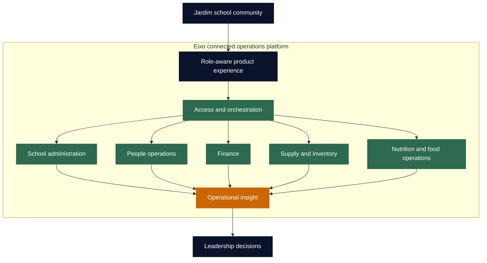

<p align="center">
  
</p>

<p align="center">
  <strong>A connected operations platform for a care-first school.</strong>
</p>

<p align="center">
  <a href="#the-context">Context</a> &nbsp;|&nbsp;
  <a href="#the-engineering-challenge">Challenge</a> &nbsp;|&nbsp;
  <a href="#the-system-design">System design</a> &nbsp;|&nbsp;
  <a href="#engineering-decisions">Decisions</a> &nbsp;|&nbsp;
  <a href="#public-portfolio-boundary">Boundary</a>
</p>

<p align="center">
  
  
  
</p>

# Eixo x Jardim

Eixo is a custom operations platform being developed for [Jardim Espaço de Educação](https://jardimespacoeducacao.com.br/), an early-childhood school in Jacarepaguá, Rio de Janeiro. This repository presents the engineering case behind the system: how a school built around care, learning, nutrition, and family trust can gain a more connected operational backbone without losing the human quality of its work.

> The design goal is not to make a school feel like an ERP. It is to give every team a clearer way to care for the work in front of them, while making the organization easier to understand as a whole.

---

## The context

Jardim serves children from early infancy through early childhood in a setting where care and education are inseparable. Its public educational proposition emphasizes affection, autonomy, attentive listening, structured routines, and healthy food prepared as part of the school day.

That is meaningful engineering context. A school like Jardim does not run on a single workflow. It runs on many interdependent routines: educational administration, team coordination, food planning, purchasing, inventory, financial control, family-facing processes, and leadership decisions. When those routines are managed in separate tools or informal channels, the real cost is not only duplication. It is lost context.

Eixo was conceived to make that context visible, usable, and appropriately bounded.

## The engineering challenge

The technical challenge was to create a system that supports multiple operational domains without forcing them into a single, generic interface or a tightly coupled codebase.

The product needed to balance two truths:

| At the edge of the operation | At the level of the school |
| --- | --- |
| A team needs a calm, focused view of the work it owns. | Leadership needs a trustworthy, connected picture of the operation. |
| A workflow should remain usable when an adjacent process is incomplete. | Important events should inform downstream decisions. |
| Access must reflect real responsibilities. | Information must move without becoming indiscriminately visible. |

The result is a system direction built around **focused workspaces, explicit domain boundaries, and shared operational signals**.

## The system design

Eixo treats the school as a connected set of capabilities rather than one large administrative screen. The architecture is organized so that each area can own its rules and experience while contributing to a broader operational picture.



This model is deliberately practical:

- **Teams keep focus.** Each area receives an experience shaped around its actual work instead of an all-purpose back office.
- **Boundaries stay explicit.** Business rules, data ownership, and responsibilities are clearer when domains are designed as independent capabilities.
- **Signals travel with intent.** Relevant events can inform adjacent workflows and management visibility without turning every detail into shared data.
- **The organization can evolve.** New capabilities can be added without asking every existing module to become more complex.

## What Eixo brings together

| Capability | The operational question it helps answer |
| --- | --- |
| **School administration** | What needs to happen to keep the academic and administrative routine moving? |
| **People operations** | How can team processes be managed with clearer ownership and appropriate access? |
| **Finance** | What is the current operational and financial picture behind the school day? |
| **Supply and inventory** | What needs to be requested, purchased, replenished, or reconciled? |
| **Nutrition and food operations** | How can planning and execution support a healthy, dependable meal routine? |
| **Leadership view** | Which signals deserve attention, action, or a closer conversation? |

The purpose is not to centralize every action. The purpose is to make the right handoff, dependency, and decision visible at the moment it matters.

## Engineering decisions

| Decision | Why it matters for Jardim |
| --- | --- |
| **Domain-aligned architecture** | Different areas of a school change at different speeds. Clear ownership prevents one workflow from destabilizing another. |
| **Role-aware access** | Educational, operational, and leadership responsibilities require different levels of context and control. |
| **Service-oriented integration** | Capabilities can exchange only the information they need through explicit contracts instead of a shared implementation. |
| **Resilient workflow design** | The school day continues even when a related record or handoff needs later reconciliation. |
| **Data quality as infrastructure** | Validation and processing are treated as part of reliable operations, not as an afterthought for reporting. |
| **Containerized delivery** | Repeatable environments make it safer to develop, test, and evolve the system over time. |

## Technology, selected intentionally

<p>
  
  
  
  
  
  
</p>

The implementation combines Python application services, modern TypeScript web experiences, relational data stores, data-processing pipelines, containerized environments, and automated quality checks. The stack is not the case study by itself. It is the foundation that makes the product decisions above sustainable.

## Success is more than a dashboard

Eixo is being developed to improve the quality of operational work before it improves the quality of reporting.

```text
Clearer next action
        +
Reliable handoffs between teams
        +
Appropriate access to context
        +
Signals leaders can act on
        =
An operation that can care for details without losing the whole picture
```

No operational metrics, personal data, or internal performance figures are published here. That is intentional: an engineering case study should show the problem-solving approach without turning a school's private reality into public collateral.

## Public portfolio boundary

This is a curated public case study. The production codebase, deployment configuration, operational records, credentials, integration details, and personal information remain private.

What is shared here is the part worth evaluating in public: the framing of the problem, the product model, the architectural choices, and the engineering discipline required to build a responsible system for a real organization.

## Current direction

**Actively in development.** Eixo continues to evolve with the operational reality of Jardim, through ongoing work in product design, domain modeling, interaction design, and software engineering.

<p align="center">
  <sub>Engineering case study by <a href="https://github.com/maykonlincolnusa">@maykonlincolnusa</a> for <a href="https://jardimespacoeducacao.com.br/">Jardim Espaço de Educação</a>.</sub>
</p>
